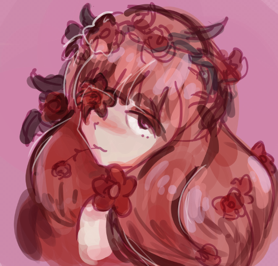

# Hanami osu!

**Open-source osu! tools, a live browser game, and work in progress.**

Hanami is a small family of independently useful projects for the osu! community.

[Website](https://hanami.yorunoken.com) · [Community](https://discord.gg/RcGjBZkDP6) · [Sponsor yorunoken](https://github.com/sponsors/yorunoken) · [Issues & planning](https://github.com/hanami-osu/infra/issues)

## Projects

| Project | Purpose | Status |
| --- | --- | --- |
| [Hanami Bot](https://github.com/hanami-osu/bot) | osu! statistics, tracking, and utilities for Discord | Available |
| [osu!guessr](https://github.com/hanami-osu/osu-guessr) | A browser game for identifying beatmaps from audio and images | [Live](https://osuguessr.com) |
| [Hanami Companion](https://github.com/hanami-osu/companion) | A desktop companion for local osu! integrations | In development |
| [Hanami Web](https://github.com/hanami-osu/web) | The public website and shared account platform | Website live, accounts in development |

## How the ecosystem fits together

Each project is developed, deployed, and released independently. Hanami Web connects Bot account linking and osu!guessr sign-in.

## Open source

Published Hanami code, issues, and project history are public. Live products, released packages, and prototypes are labeled separately so their current state is clear.

## Contributing

Contributions, bug reports, translations, and feature suggestions are welcome.

For project-specific work, use that project's issue tracker. For organization-wide planning, shared infrastructure, account systems, cross-project integrations, or work where the correct repository is unclear, use [hanami-osu/infra](https://github.com/hanami-osu/infra/issues).

Read the organization [contributing guide](../CONTRIBUTING.md) before opening a larger change. Report security vulnerabilities through the [security policy](../SECURITY.md), never through a public issue.

---

Hanami is an independent community project and is not affiliated with or endorsed by osu! or ppy Pty Ltd.
